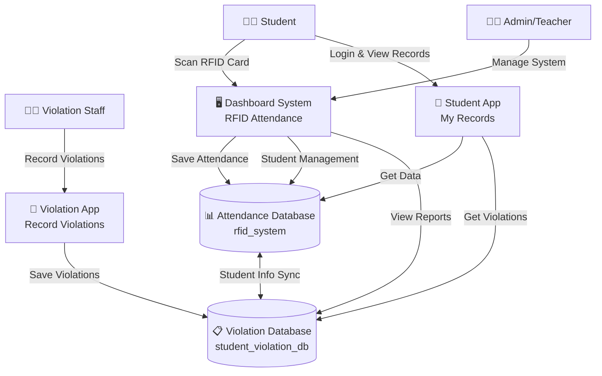

# 📊 Simple Data Flow Diagram - School Management System

## System Overview
A school management system with **3 main applications** working together:
1. **Dashboard** - Web-based RFID attendance system
2. **Student App** - Mobile app for students to view their records
3. **Violation App** - Mobile app for staff to record violations

## 🔄 Simple Data Flow



## 📱 How It Works

### 1. **RFID Attendance Flow**
```
Student scans RFID → Dashboard reads card → Saves to Attendance Database
```

### 2. **Student Mobile App Flow**
```
Student opens app → Logs in → Views attendance & violations from both databases
```

### 3. **Violation Recording Flow**
```
Staff opens violation app → Searches student → Records violation → Saves to Violation Database
```

### 4. **Data Synchronization**
```
Both databases share student information to keep records consistent
```

## 🗄️ Database Structure

### Attendance Database (rfid_system)
- **Students** - Basic student info + RFID numbers
- **Attendance** - Time in/out records
- **Admins** - System administrators

### Violation Database (student_violation_db)
- **Students** - Student profiles (synced with attendance DB)
- **Violations** - Violation records and penalties
- **Violation Types** - Categories of violations

## 🔧 Key Features

- **Real-time RFID scanning** for attendance
- **Offline mobile apps** that sync when online
- **Cross-database student matching** using student IDs
- **Automatic data synchronization** between systems
- **Export reports** for administrators

## 💡 Simple Summary

1. **Students use RFID cards** to mark attendance on the dashboard
2. **Students use mobile app** to view their attendance and violations
3. **Staff use violation app** to record student infractions
4. **All data is automatically synchronized** across the system
5. **Admins can export reports** and manage the entire system

---
*This is a simplified view. For detailed technical documentation, see [DATA_FLOW_DIAGRAM_README.md](DATA_FLOW_DIAGRAM_README.md)*